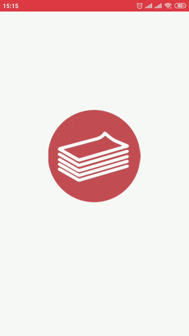
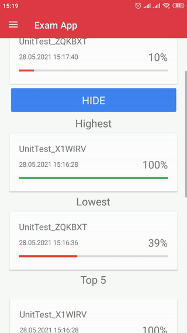

# Exam/quiz Application

## Description
This is a prototype of exam/quiz android application that I developed with Xamarin.Forms for a small tech retail company to testing their sellers and employes. App contains very basic functionality as creating, editing and deleting things, history and passing. 

## Preview

  
  

## Notes and features
* **Basic statistic**. App main screen contains basic user statistic information such as average total mark, last passed and top list.
* **Detailed result**. By tapping on already passed exam user can inspect detailed info about each question.
* **Create/edit exam/quiz**. In create/edit screen user can control publish status (published or draft), edit ordering of questions and answers with easy to use drag-n-drop and also other basic controls.
* **Passing**. User can pass exam/quiz by tapping play button in exams list. Proccess of passing is standart - read question, choose answer, go next.
* **History**. App also saves all user history which can be seen in history menu, it's contain date, result and detailed view with questions info. 
* **Database**. For store application data used SQLite database.
* **Demo data**. App contains demo menu with possibility to fill app with demo data.
* **Tests**. For testing app logic solution includes a sub-project with unit tests.

## Todos
In original plan to expand this app was next things:
* **Remote database**. To add possibility to restore users data and share it.
* **Users system**. Which means to separate usual and main users. Originally intended there will be a parent user that can create/edit exams and browse results of a child users.
* **Sorting and ordering**. In cases with large number of data it will make user experience more comfortable.
* **Help**. Info screen to show users how to work with app correctly and use all features effectively.
* **Tags system**. To enable search feature and make navigation easier.
* **Media**. Possibillity to use media files such as video or pictures as question or answer.
* **Design**. For now it's very pure, minimal, hastily created design that needs some big rework.
